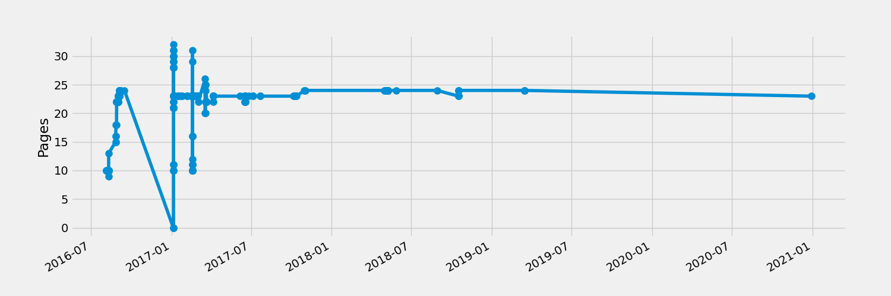
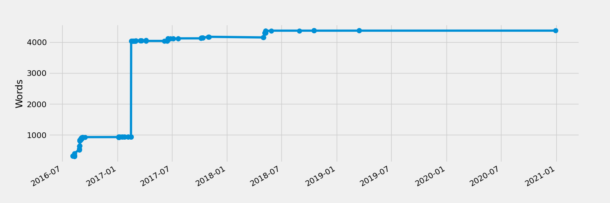

# markdown-memo

This project is a [clone](http://rreece.github.io/sw/markdown-memo/).

**What have I done**
- Fixed issues with pandoc.
- ported it from python 2 to python 3
- keeping it here for future reference

## License

License: GPL <http://www.gnu.org/licenses/gpl.html>

## Requirements

- make
- LaTeX (texlive)
- python
- pandoc
- [pandoc-crossref](https://github.com/lierdakil/pandoc-crossref)
- matplotlib (for pagecount and wordcount plots)
- xpdf (pdfinfo command for pagecount)

    sudo pacman -S wget
    sudo pacman -S xpdf
    sudo pacman -S pandoc
    sudo pacman -S pandoc-crossref
    yay -S texlive-full

    sudo pip install scipy
    sudo pip install matplotlib
    sudo pip install pandas

## Features

### html

- [disqus comments](disqus.com)
- mathjax LaTeX rendering
- google analytics tracking
- automatically generates an `index.md`

If you want to write your own `index.md`,
then put the same markdown in `index.txt`.

### pdf

- LaTeX
- fancyheader

### both

- appendices
- bibtex bibliographies
- footnotes
- multiple authors
- word- and page-count plots (see below)

## Getting started

- Clone/fork this package and possibly rename the `markdown-memo`
  directory as your project.
- Put some `*.md` files in that directory.
- In those files, just start writing the `h1` heading.
  There's no need for additional markup or html.
  Examples of [Markdown](http://daringfireball.net/projects/markdown/)
  syntax are

      Section 1
      =================================

      Sub-section 1
      ---------------------------------

      [Lorem ipsum](https://en.wikipedia.org/wiki/Lorem_ipsum)
      dolor sit amet, duo ut putant verear, nam ut brute utroque.
      Officiis qualisque conceptam te duo, eu vim soluta numquam, has ut aliquip
      accusamus. Probo aliquam pri id. Mutat singulis ad vis, eam euismod pertinax
      an, ea tale volumus vel. At porro soleat est. Debet facilis admodum an sed,
      at falli feugiat est.

      1.  one
      1.  two
      1.  three

      You can do latex in-line, $e^{i\pi} + 1 = 0$, like that.
      Or equations:

      \begin{equation}
          \int_{\partial\Omega} \omega = \int_{\Omega} \mathrm{d}\omega \,.
      \end{equation}

- Edit the metadata in `meta.yaml`.
- Call `make` to generate valid xhtml.
- Call `make pdf` to generate a pdf document.
- Call `make clean` to delete temporary LaTeX files.
- Call `make realclean` to additionally delete the output html and pdf files.

I use an image of my email to hide it from text crawlers.
Please replace `img/my-email.png` with a screenshot of your
email address instead of mine,
or just remove the use of the image in `meta.yaml`.

Customize the files in `templates/` to adjust the format
of the output html and pdfs files to your needs.

If you want to put the html online, perhaps a solution for you,
because it's free and easy, would be to host the pages at github.
See: [pages.github.com](https://pages.github.com/).

## Special files

There are a few special files that help steer the execution of markdown-memo
or are otherwise exceptional.

Documentation:

- `README.md` - This file. Please empty this file and adapt it to your project.

Primary files edited by the user:

- `meta.yaml` - The main metadata file controlling the project in many ways.
- `*.md` - Any other user-created Markdown files, the markup of your document.

Optional files:

- `index.[md,txt]` - The top-level, root file of your project. By default, if `index.txt` is missing,
  a table of contents is generated for `index.md`, otherwise (the user-written) `index.txt`
  is copied to be the `index.md`.
- `bib_index.md` - Call `make bib_index.md` to generate this file. It is to help incoorporate citations
  into your document by being an automatically generated list of the references, with footnotes,
  created from the available bibliography files in `bibs/`.
- `order.txt` - Optionally, the user can create this file, which should have a list of
  Markdown files used in the document, one-per-line, in the order as to be used for the
  navigation buttons in the html template. By default, building the html will generate this
  file if it doesn't already exist, with the Markdown files listed in alphabetical order.
  If one names the Markdown files something like `01-first-section.md`, `02-second-section.md`, etc.,
  then the order should be handled automatically.

## Disqus integration

You can choose to append a comments section at the end of your html.
Just register a user name and the site name with [disqus.com](disqus.com).
Then in the `meta.yaml`, set `disqus: true`, and set your `disqus_shortname`.

## Word count

Note that word-count and page-count plots are generated when you call `make pdf`.
You might want to keep these around in the `README.md` for your document.

### Reference

http://rreece.github.io/sw/markdown-memo/